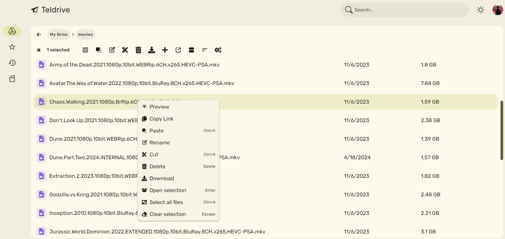
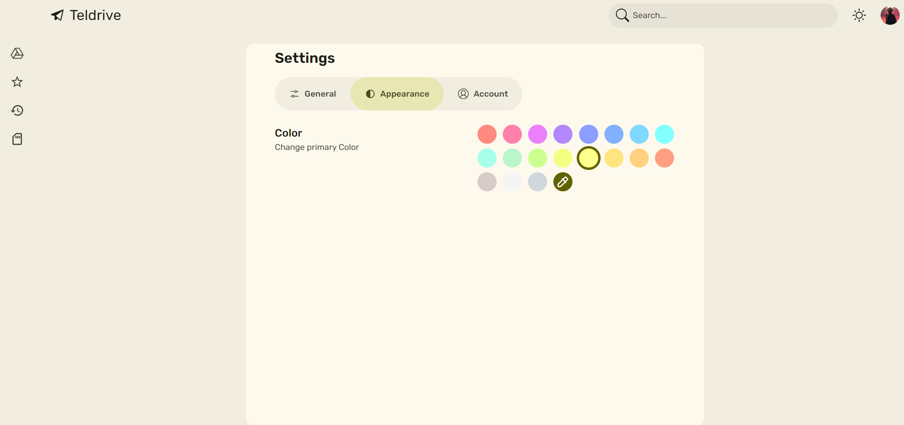
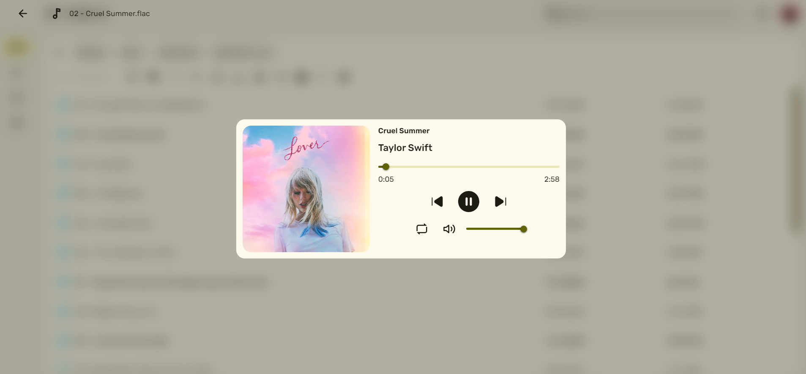
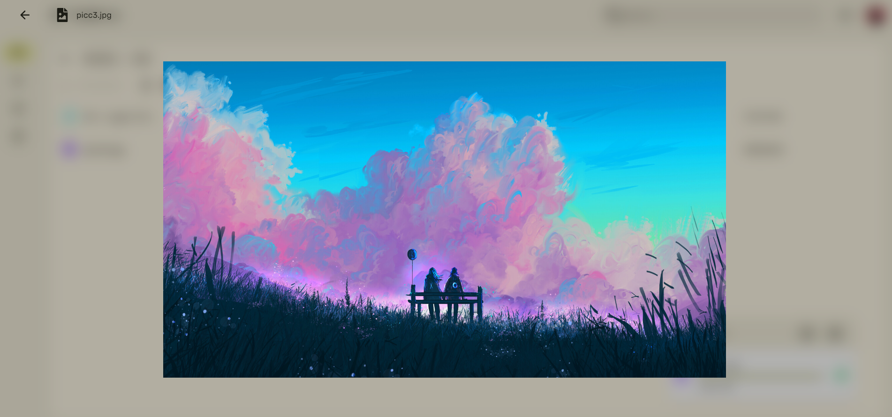
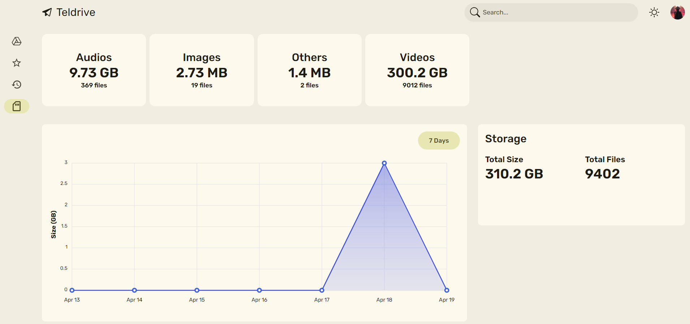
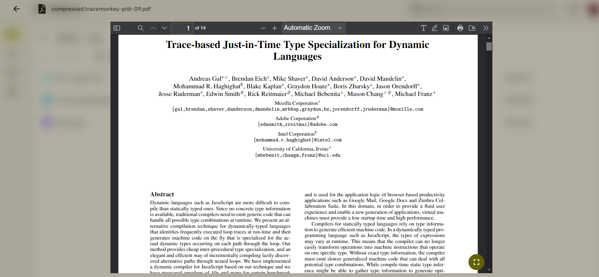
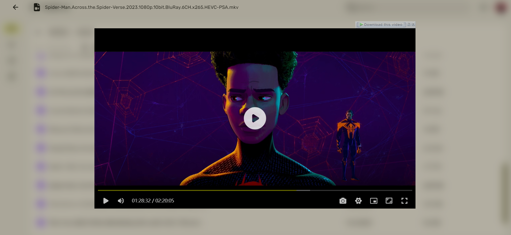

# Teldrive

Teldrive is a powerful utility that enables you to organize your Telegram files and unlock their full potential as cloud storage.

## Features

### 🚀 Ultrafast & Lightweight
Built with Go for exceptional performance with minimal resource usage:
- Lightning-fast file operations
- Small binary footprint (under 20MB)
- Efficient memory management
- Cross-platform compatibility (Windows, macOS, Linux)

### 🎨 Sleek Material You Design
Modern and intuitive user interface:
- Material You design system
- Dynamic color theming
- Responsive layouts for all devices
- Seamless dark/light mode switching
- Clean and intuitive file navigation

### 🔄 Rclone Integration
Seamless integration with Rclone for enhanced functionality:
- Mount as a standard remote storage
- Use familiar Rclone commands
- Sync with other cloud storage services
- Set up automated backups
- Cross-platform file management

### 🔐 Robust Encryption
Protect your files with robust encryption:
- Secure individual file chunks
- End-to-end encryption
- Compatible with standard tools

<b>More Screenshots</b>

 

[UI Repository](https://github.com/tgdrive/teldrive-ui)

[UI Component Library](https://github.com/divyam234/tw-material)
